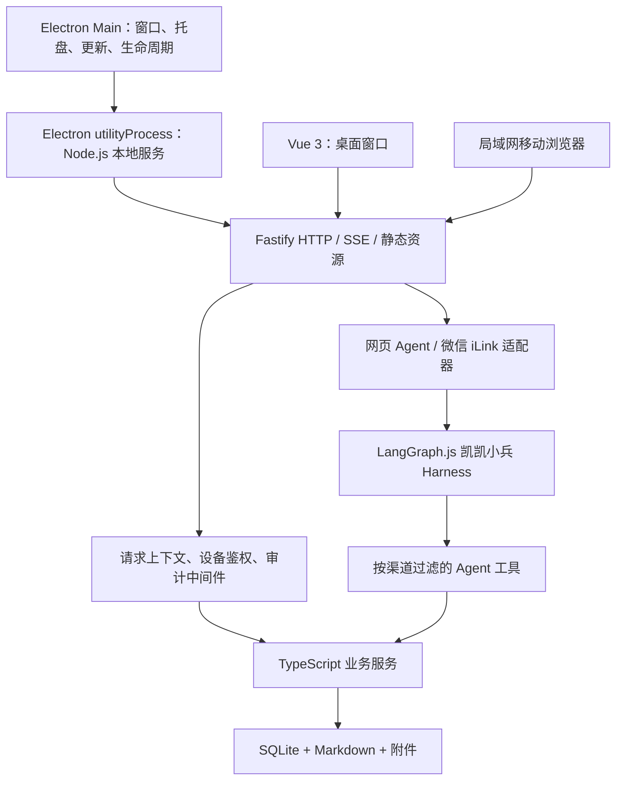
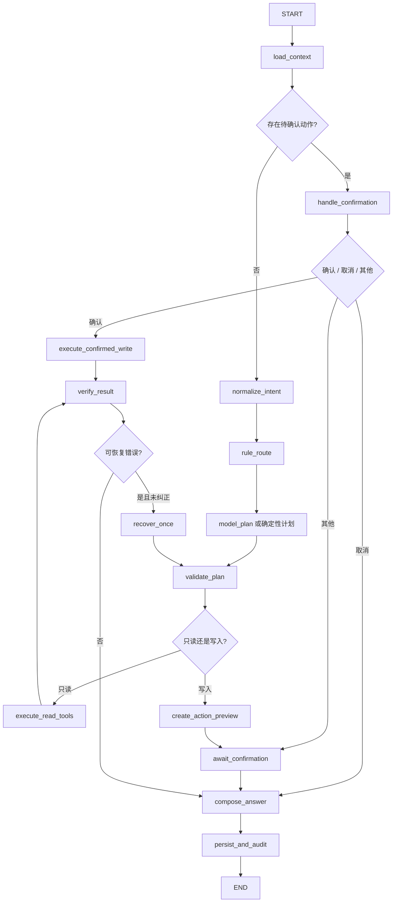

# Node.js 后端与凯凯小兵 Agent 改造实施方案

> 建立日期：2026-08-11
> 文档状态：待执行
> 目标读者：负责实施迁移的编程 Agent、代码审查 Agent 和发布验收人员
> 技术决策：FastAPI 全量迁移至 Node.js/TypeScript；凯凯小兵迁移至 LangGraph.js，复用 LangChain Core 的消息、工具和模型适配能力
> 当前阶段：MIG-00 至 MIG-08 已完成；下一步 MIG-09 输出、个人与系统运维（报告、健康、Excel、备份恢复、迁移包、更新）。不授权删除 Python 后端、修改真实数据库、提交、推送或发布

## 1. 文档职责与执行优先级

本文件是本次后端与 Agent 技术迁移的唯一主执行方案。它负责定义目标架构、迁移顺序、工作包边界、验收门槛、回滚方式和其他编程 Agent 的协作规则。

执行前按以下顺序读取资料：

1. [`AGENTS.md`](AGENTS.md)：仓库级安全、数据、测试和架构约束。
2. 本文件：Node.js 与 LangGraph 迁移的工作包、顺序和完成标准。
3. [`docs/系统功能开发计划.md`](docs/系统功能开发计划.md)：业务功能依赖和业务闭环定义。
4. [`docs/Agent能力矩阵.md`](docs/Agent能力矩阵.md)：Agent 工具、参数、风险和渠道权限的当前登记。
5. [`docs/Agent代理清单.md`](docs/Agent代理清单.md)、[`docs/Agent回归报告.md`](docs/Agent回归报告.md)和[`docs/Agent与微信接入配置.md`](docs/Agent与微信接入配置.md)：Agent、评测和微信现状。
6. 当前源码、数据库迁移和测试：当文档与实现冲突时，以可复现的代码和测试结果为准，并先记录冲突，不能静默选择一种解释。

本计划不会替代业务功能计划。迁移期间原则上冻结新业务功能，只允许处理阻塞迁移的缺陷、安全问题和已明确批准的需求。

## 2. 最终决策

### 2.1 是否直接改成 Node.js

决定执行 Node.js/TypeScript 全量迁移，但采用“模块化替换 + 行为等价验证”，不采用一次性推倒重写。

原因如下：

- 项目已经具备 Electron 客户端，Node.js 能减少桌面发行包中的 Python 运行时和 PyInstaller sidecar，统一桌面生命周期、构建工具和发布链路。
- 前端、桌面壳和目标后端都使用 JavaScript/TypeScript，可共享类型、校验方式和工程工具。
- 当前后端已经包含大量成熟业务规则、SQLite 迁移、文件处理和 Agent 安全边界；这些能力必须逐项迁移和验证，不能因为更换语言而重新设计业务。
- 当前本地扫描约有 2.1 万行 Python 应用代码、20 余个路由模块、20 余个服务模块和 100 余项后端测试。范围决定了迁移必须保留 FastAPI 作为行为基准，直到 Node.js 对应模块通过等价测试。

### 2.2 凯凯小兵采用 LangGraph 还是 LangChain

采用以下组合：

- `@langchain/langgraph`：负责显式状态图、条件边、循环上限、暂停/恢复、检查点和流式事件。
- `@langchain/core`与必要的模型适配包：负责消息、工具定义、结构化参数和模型接口。
- 项目自有业务服务、权限过滤、计划校验、写入确认、审计、幂等和恢复机制继续作为安全边界。

不直接把现有 Agent 替换为一个高层 `createAgent` 或通用 ReAct 黑盒。现有凯凯小兵包含确定性意图路由、结构化计划、工具范围校验、一次纠错、重复失败熔断、敏感渠道过滤和确认写入状态机，这些行为需要在自定义 LangGraph `StateGraph` 中明确表达和单独测试。

### 2.3 不把框架当成业务层

LangGraph 只属于 Agent Harness。依赖方向保持为：

```text
网页 / 微信渠道
    ↓
LangGraph Agent Harness
    ↓
Agent 工具适配层
    ↓
Node.js 业务服务
    ↓
SQLite / Markdown / 附件文件
```

Agent 工具不得直接调用 HTTP 路由，不得直接操作数据库；业务服务不得依赖 LangGraph、网页 Agent 或微信。

## 3. 成功标准

只有同时满足以下条件，才能认为迁移完成：

1. Electron 安装包默认只启动 Node.js 后端，不再依赖用户安装 Python，也不再打包 PyInstaller sidecar。
2. Vue 前端主要流程不需要因后端换语言而改变行为；现有 `/api/*` 路径、状态码、响应字段、下载语义和 SSE 事件保持兼容。
3. 已有 SQLite 数据库可由 Node.js 直接打开，迁移版本、表、索引、外键、数据、审计和附件关联不丢失。
4. 新数据库、旧版本数据库、固定迁移样本和用户数据副本的升级均通过备份、完整性和重复启动验证。
5. 系统业务测试、API 契约测试、前端构建、浏览器冒烟、Electron 冒烟和 Windows/macOS 打包验证通过。
6. 凯凯小兵的当前工具、渠道权限、会话隔离、确认写入、幂等、备份、审计、流式响应和固定回归样例全部通过。
7. Agent 迁移后不得增加未登记工具，不得放宽微信敏感权限，不得持久化或展示模型隐式思维链。
8. 模型不可用、Agent 异常或微信断开时，系统页面和普通业务 API 仍可正常使用。
9. 经过至少一次使用隔离数据的完整发布候选验收和一次升级/回滚演练。
10. Python 后端的删除必须由用户另行明确批准；其他编程 Agent 不得把“Node.js 已可运行”解释为自动授权删除旧实现。

## 4. 明确不做

本次迁移不包含：

- 新增业务模块、重做 UI、调整业务口径或重新设计数据库模型。
- 云端、多租户、账号体系、PostgreSQL、独立移动 App 或公网服务。
- 把局域网入口暴露到公网，或移除设备配对和撤权。
- 新增 Agent 删除、批量高风险写入、敏感字段写入、多账号、群聊、多模态或 MCP。
- 使用 ORM 自动重建现有数据库结构。
- 把 LangSmith 或其他云端观测平台设为运行前提。
- 同时让 FastAPI 和 Node.js 对同一份真实 SQLite 数据库执行写入。
- 为了“代码更漂亮”顺手重构与当前工作包无关的业务逻辑。

## 5. 目标架构



### 5.1 进程边界

- Electron Main 只负责桌面生命周期、安全窗口、托盘、下载、更新和启动/停止服务。
- Node.js 后端运行在 Electron `utilityProcess` 中，不直接运行在 Electron Main 内，避免数据库、Excel、模型或微信异常阻塞桌面主进程。
- 开发模式和局域网模式保留独立的 Node.js 启动入口，便于无 Electron 调试和移动端访问。
- 默认仅监听 `127.0.0.1`；只有显式 `--lan` 才监听 `0.0.0.0`，并继续执行短时配对和设备凭证校验。
- Node 服务就绪后通过结构化 IPC 或机器可读启动消息把实际端口交给 Electron；继续保留 `/api/system/health` 作为端到端就绪检查。

### 5.2 目标目录

迁移期间不移动现有 `backend/`，新增 `server/`：

```text
server/
├── package.json
├── tsconfig.json
├── src/
│   ├── entry.ts                 # CLI / utilityProcess 共用入口
│   ├── app.ts                   # 创建 Fastify 实例，不产生隐式启动副作用
│   ├── lifecycle.ts             # 启动任务、就绪、优雅退出
│   ├── config/                  # 路径、端口、版本、业务日期、环境变量
│   ├── db/                      # 连接、事务、备份、迁移、schema 检查
│   ├── http/
│   │   ├── plugins/             # 请求范围、设备鉴权、审计、错误映射
│   │   ├── schemas/             # HTTP JSON Schema
│   │   └── routes/              # 与现有 routers 对应
│   ├── services/                # 业务能力唯一实现位置
│   ├── agent/
│   │   ├── graph/               # State、节点、条件边、检查点
│   │   ├── tools/               # 工具定义、权限和服务适配
│   │   ├── model/               # OpenAI-compatible 模型适配
│   │   ├── sessions/            # 会话、压缩、兼容迁移
│   │   ├── actions/             # 预览、确认、幂等、备份、审计
│   │   └── evals/               # 固定回归和轨迹评测
│   ├── wechat/                  # iLink 渠道适配器
│   └── files/                   # Excel、上传、下载、知识库和迁移包
├── static/                      # Vue 构建产物；生成目录，不手工编辑
└── tests/
    ├── unit/
    ├── integration/
    ├── contract/
    ├── fixtures/
    └── agent/
```

目录不是引入额外分层的理由。业务服务可直接使用集中式数据库工具执行明确 SQL；不为了形式引入 ORM、Repository 基类或依赖注入框架。

## 6. 技术基线与选型

版本只在每个工作包开始时锁定一次，中途不得无关升级。以下为 2026-08-11 的参考基线，实施 Agent 必须用官方发布页或 `npm view` 重新确认并把实际版本写入锁文件和交付记录。

| 能力 | 推荐选择 | 决策说明 |
|---|---|---|
| 运行时 | Node.js 24 LTS | 与当前支持版 Electron 所带 Node 主版本对齐；开发、CI 和打包使用同一主版本 |
| 语言 | TypeScript，`strict: true` | 新服务代码禁止用 JavaScript 绕过类型检查 |
| 包管理 | npm + lockfile | 沿用项目现有工具，不额外引入 pnpm/yarn |
| HTTP | Fastify 5 | 轻量、内建 JSON Schema/Ajv、Pino 日志和 `inject` 测试能力 |
| API 文档 | `@fastify/swagger`、`@fastify/swagger-ui` | 保留 `/openapi.json` 和 `/docs` 检查能力 |
| 静态资源/上传 | `@fastify/static`、`@fastify/multipart` | 替代 FastAPI 静态文件和 `UploadFile` |
| SQLite | `better-sqlite3` | 保留同步事务和 WAL；适合本地单用户工作台 |
| Agent 图 | `@langchain/langgraph` | 显式状态、条件边、检查点、暂停/恢复和流式事件 |
| Agent 基础 | `@langchain/core`、必要模型适配包 | 只使用需要的消息、工具和模型抽象 |
| 检查点 | `@langchain/langgraph-checkpoint-sqlite` | 使用独立 Agent 运行时数据库，不让框架自动修改业务表 |
| Excel | 优先评估 `exceljs` | 先通过固定工作簿兼容试验，再成为正式依赖 |
| 测试 | Vitest + Fastify `inject` + Playwright | 单元、集成、API 契约和真实 UI 分层验证 |
| 日志/追踪 | Fastify/Pino + OpenTelemetry 语义 | 默认本地保存并脱敏，云端导出必须显式选择 |

`node:sqlite` 在当前官方文档中仍标为 Stability 1.2（Release candidate），本次不把它作为唯一生产数据库驱动。若以后改用，必须单独进行数据库兼容和打包评审。

`better-sqlite3` 和 LangGraph SQLite checkpointer 都包含原生模块。正式采用前必须完成 macOS arm64、macOS x64 和 Windows x64 的 Electron ABI、签名、公证和安装后启动试验；不能只在开发机上通过就进入迁移主线。

## 7. 必须保持的系统不变量

### 7.1 API 不变量

- 保留所有现有 `/api/*` 路径、HTTP 方法、查询参数、请求体、状态码和关键响应字段。
- 错误响应继续提供前端可消费的 `detail`；不能把所有业务错误改成统一 500。
- 文件下载保留内容类型、UTF-8 文件名、`Content-Disposition` 和流式语义。
- Agent SSE 保留当前事件类型和顺序；扩展事件只能向后兼容。
- 根页面、`/assets/*`、`/favicon.svg`、`/docs` 和 `/openapi.json` 在切换后可用。

### 7.2 数据不变量

- SQLite 继续是运行时唯一结构化数据源；Excel 只用于导入和导出。
- 继续启用 WAL、`busy_timeout=5000`、外键检查和一致性备份。
- 迁移表和版本号保持连续；更换语言本身不能制造一个空迁移版本。
- 迁移前自动备份、迁移失败回滚、重复启动幂等、高版本拒绝启动等行为必须保留。
- 派生数据仍在读取时计算，不因迁移写回数据库。
- `WORKBENCH_DATA_DIR`、`WORKBENCH_KB_DIR`和`WORKBENCH_BUSINESS_DATE`语义保持一致。
- 测试只使用临时目录，禁止用 `data/workbench.db` 验证迁移。

### 7.3 业务和安全不变量

- 班级/学期范围必须是请求级上下文，不得变成进程级可变全局变量。
- 已归档学期只读、软删除、回收站、审计和永久删除本机限制保持不变。
- 本机免配对、局域网设备短时配对、凭证哈希、过期和撤权保持不变。
- 写操作必须经过业务服务；没有显式审计的写请求由请求中间件补充审计。
- 电话、地址、API Key、令牌等敏感值不进入日志、追踪、截图、测试夹具或 Agent 工具结果。
- 文件上传继续执行大小、类型、文件名、相对路径、原子写入和失败清理校验。

### 7.4 Agent 不变量

- 网页会话使用 `web:{用户}:{会话}`，微信使用 `wechat:{微信用户}`，不得跨渠道复用。
- 发送给模型的工具列表按渠道和权限过滤；工具注册表不是授权边界。
- 全班/多学生问题不得退化为逐个档案读取；批量结果返回总数、限制、截断和空结果含义。
- 同一错误工具调用最多自动重试一次；计划最多自动重建一次；超过限制必须停止。
- 四个当前写工具继续执行“预览 → 明确确认 → 参数哈希复核 → 备份 → 业务服务 → 验证 → 审计”。
- 删除、批量和敏感写入仍然禁止。
- 不保存或展示模型隐式思维链；只保存用户消息、可见回答、结构化计划摘要、工具调用和工具结果。

## 8. 迁移方法：等价替换，不双写

迁移采用以下循环：

```text
冻结旧模块行为
  → 建立固定输入、API、数据库和文件基线
  → 先移植业务服务
  → 再接 Node 路由
  → Python 与 Node 分别使用克隆数据执行同一用例
  → 规范化时间、临时路径和自增 ID 后比较
  → 通过前端与桌面验证
  → 标记该工作包完成
```

禁止两个运行时同时写同一数据库。差异测试必须为 Python 和 Node 各复制一份相同的输入数据库和文件目录，分别执行后比较结果。

允许规范化的非确定字段只有：运行时间、临时绝对路径、随机短码、端口、进程 ID和明确声明的自增 ID。业务数值、状态、关联、审计动作和文件内容不得被规范化掉。

## 9. 主工作包与依赖顺序

| 顺序 | 工作包 | 目标 | 状态 |
|---:|---|---|---|
| 0 | `MIG-00` 回归与契约基线 | 固定旧系统可比较行为 | ✅ 已完成（2026-08-11，工具在 `migrate/baseline/`） |
| 1 | `MIG-01` 技术试验与依赖锁定 | 排除 SQLite、Excel、Electron ABI 风险 | ✅ 已完成（2026-08-11，工具在 `migrate/mig-01/`，详见 20.2 节） |
| 2 | `MIG-02` Node 服务骨架 | Fastify、配置、生命周期、静态资源、错误和日志 | ✅ 已完成（2026-08-11，工程在 `server/`，详见 20.3 节） |
| 3 | `MIG-03` SQLite 与迁移引擎 | 原库直读、备份、事务、全部历史迁移 | ✅ 已完成（2026-08-11，`server/src/db/`，详见 20.4 节） |
| 4 | `MIG-04` 请求范围与安全底座 | 班级学期、设备鉴权、审计、回收站、业务日期 | ✅ 已完成（2026-08-11，`server/src/services/` + 请求上下文插件，详见 20.5 节） |
| 5 | `MIG-05` 基础资料与通用数据 | 学生、导入、工作表、座位、统计 | ✅ 已完成（2026-08-11，`server/src/services/` + mig05 路由，详见 20.6 节） |
| 6 | `MIG-06` 行动闭环 | 工作项、流程、首页、沟通、事件、关注 | ✅ 已完成（2026-08-11，`server/src/services/` + mig06 路由，详见 20.7 节） |
| 7 | `MIG-07` 高频教师业务 | 考勤、成绩、任务、值日、校历 | ✅ 已完成（2026-08-11，`server/src/services/` + mig07 路由，详见 20.8 节） |
| 8 | `MIG-08` 账目与教育沉淀 | 积分、班费、评语、教育记录、知识库 | ✅ 已完成（2026-08-11，`server/src/services/` + mig08 路由，详见 20.9 节） |
| 8 | `MIG-08` 账目与教育沉淀 | 积分、班费、评语、教育记录、知识库 | ✅ 已完成（2026-08-11，`server/src/services/` + mig08 路由，详见 20.9 节） |
| 9 | `MIG-09` 输出、个人与系统运维 | 报告、健康、Excel、附件、备份恢复、迁移包、更新 | ⬜ 待开始 |
| 10 | `AGENT-00` Agent 基线与模型层 | 固定轨迹并移植模型/工具契约 | ⬜ 待开始 |
| 11 | `AGENT-01` LangGraph Harness | 状态图、检查点、计划、执行、验证和纠错 | ⬜ 待开始 |
| 12 | `AGENT-02` 确认写入与会话 | 暂停恢复、确认状态机、会话压缩和审计 | ⬜ 待开始 |
| 13 | `AGENT-03` 网页与微信渠道 | SSE、网页会话、iLink、去重、断线恢复 | ⬜ 待开始 |
| 14 | `MIG-10` Electron 切换 | utilityProcess、打包、签名、公证和更新 | ⬜ 待开始 |
| 15 | `MIG-11` 总验收与发布候选 | 全量等价、升级、回滚和发布检查 | ⬜ 待开始 |

`MIG-05` 至 `MIG-09` 可以由不同 Agent 依次执行，但不得并行修改相同表、服务或迁移文件。Agent 工作包只能在其调用的业务服务已经迁移并通过验收后开始。

## 10. 各工作包实施细则

### 10.1 `MIG-00` 回归与契约基线

**目标**：在改写代码前建立可重复、可比较的旧系统行为基线。

**必须完成**：

1. 记录当前分支、未提交文件和数据库当前迁移版本；不得清理或覆盖用户已有修改。
2. 使用隔离数据运行 Python 后端全量测试、前端构建、UI 冒烟和 Electron 冒烟，记录命令、结果和失败原因。
3. 从 FastAPI 导出 OpenAPI 快照，并生成路由清单：方法、路径、请求 schema、状态码、响应 schema、所属路由文件。
4. 建立数据库基线：空库、固定旧版迁移样本、P0/P1 样本、当前版本样本；记录表、列、索引、外键、触发器、迁移版本和关键行数。
5. 建立 API 黄金用例，至少覆盖每个路由模块的一条读取、一条写入、一条错误和一条权限/归档路径。
6. 建立文件黄金用例：学生导入模板与预览、成绩长/宽表、校历、报告、健康、通用导出、附件、知识库冲突、数据库备份和迁移包。
7. 建立 Agent 黄金轨迹：固定回归 JSON、确定性路由、模型计划、工具错误、一次重试、写入确认、敏感拒绝、会话压缩和 SSE 事件。

**完成标准**：所有基线都能在临时目录自动创建和销毁；同一基线连续运行两次结果一致；差异工具能指出 JSON、数据库和文件的具体差异，而不是只返回“不同”。

### 10.2 `MIG-01` 技术试验与依赖锁定

**目标**：先证明最危险的底层依赖可跨平台运行。

**试验 A：SQLite**

- 用 Node.js 打开当前固定数据库副本，启用 WAL、外键和 busy timeout。
- 验证事务提交/回滚、并发读取、写入冲突、备份、`integrity_check`、`foreign_key_check`和中文列名。
- 在 Electron utilityProcess 中加载 `better-sqlite3`，完成 macOS arm64、macOS x64、Windows x64 构建和安装后启动。
- 验证原生模块位于正确的 `asarUnpack`/资源位置，且 ABI 与打包 Electron 一致。

**试验 B：Excel**

- 用 `exceljs` 读取和生成全部黄金工作簿。
- 比较单元格值、日期、公式、sheet 名、列宽、冻结窗格、字体、填充、合并单元格和错误行定位。
- 若 `exceljs` 无法满足，记录具体差异后再评估其他成熟库；不得在没有证据时同时引入两个 Excel 库。

**试验 C：LangGraph**

- 建立最小 TypeScript 状态图，验证条件边、流式自定义事件、线程检查点、进程重启后恢复和人工确认暂停。
- SQLite checkpointer使用独立临时数据库。
- 验证 `interrupt` 前的副作用幂等，恢复时不会重复执行写入。

**完成标准**：三项试验均有自动化脚本和跨平台证据；依赖使用精确版本写入 lockfile；任何一项失败都先解决或重新选型，不进入大规模移植。

### 10.3 `MIG-02` Node 服务骨架

**目标**：得到不包含业务迁移的可启动、可测试服务骨架。

**范围**：

- Fastify 工厂函数、CLI 参数、端口探测、默认本机监听、`--lan`、版本和健康接口。
- 配置解析和启动时校验；业务日期与真实时钟分离。
- 统一错误类型与 `detail` 映射。
- Pino 日志脱敏、日志轮转或大小上限、启动阶段错误输出。
- Vue 静态资源、SPA 根入口、favicon、404 和 OpenAPI 文档。
- 启动任务、就绪标记、信号处理、优雅关闭和强制退出超时。

**必须避免**：模块 import 时自动监听端口、自动打开真实数据库或启动微信循环；测试必须能只创建应用实例。

**完成标准**：Node 服务在随机端口启动；健康、静态资源、404、错误格式、Ctrl+C/IPC 关闭和端口冲突测试通过。

### 10.4 `MIG-03` SQLite 与迁移引擎

**目标**：Node.js 对现有数据库实现无损、可回滚的直接兼容。

**范围**：

- 移植当前 `backend/app/db.py` 的基础 schema、全部迁移和版本判断。
- 迁移 SQL 与现有实现逐条核对；不得由 ORM重新推导表结构。
- 进程内使用一个受控连接和显式事务；长时间 CPU/Excel 任务不得持有数据库事务。
- 提供 `withTransaction`、一致性备份、受控关闭和测试切换数据目录能力。
- 每次迁移前备份；迁移失败回滚；检测高于当前程序支持的数据库版本并拒绝启动。
- 对所有基线数据库执行迁移、重复启动、完整性、外键、关键计数和旧 Python 可读性验证。

**迁移纪律**：

- 仅仅把迁移代码翻译为 TypeScript 不增加 schema 版本。
- Node 新增表/列时才创建下一版本迁移，并同步修改 Python 的高版本拒绝/兼容策略和相关文档。
- Agent checkpointer 表放在独立的 `agent-checkpoints.db`，不由 LangGraph 修改 `workbench.db` 的业务 schema。

**完成标准**：所有固定版本数据库迁移后的 schema 和数据与 Python 基准一致；100 次并发读取、受控写冲突、备份恢复和异常中断测试通过。

### 10.5 `MIG-04` 请求范围与安全底座

**目标**：先移植所有业务模块共同依赖的安全和上下文能力。

**范围**：

- 使用 `AsyncLocalStorage` 实现请求级班级、学期、渠道、操作者和审计上下文。
- 本机识别、局域网设备认证、配对、过期、撤权和最近访问时间。
- 归档只读、系统审计、参数脱敏、软删除、回收站和永久删除限制。
- 系统时钟与业务日期。
- 文件路径白名单、原子写入、哈希和临时文件清理。

**中间件顺序**：

```text
请求 ID
  → 本机/局域网设备鉴权
  → 班级/学期范围绑定
  → 渠道/操作者绑定
  → 审计上下文
  → 路由和业务服务
  → 缺省写操作审计
  → 上下文释放
```

**完成标准**：跨请求不串班级/学期；并发请求不串操作者；归档、配对、撤权、脱敏和审计测试与 Python 基准一致。

### 10.6 `MIG-05` 基础资料与通用数据

**移植顺序**：

1. 班级、学期、在班关系和上下文管理。
2. 学生档案、头像、导入模板、预览、按学号合并、导出。
3. 通用工作表元数据、行数据和派生列。
4. 座位、基础统计和学生详情时间线的底层查询。

**验收重点**：中文字段、空值、学号唯一、跨班级/学期隔离、归档写保护、导入整批回滚、故障行报告、头像路径与类型安全。

### 10.7 `MIG-06` 行动闭环

**移植顺序**：

1. 统一工作项。
2. 事件、家校沟通和关注事项。
3. 来源联动、过程记录、复查和学生时间线。
4. 首页行动中心和相关统计。

**验收重点**：来源幂等、完成/取消/重开双向回写、时间筛选、URL 定位、并发创建、审计和状态不矛盾。

### 10.8 `MIG-07` 高频教师业务

拆成独立提交或子工作包，依次迁移：

1. 考勤记录、场景、统计、规则执行、命中和工作项联动。
2. 考试、科目、成绩导入、统计、合法选科组合、异常规则和排名。
3. 班级任务、材料、附件、模板、值日、轮换和冲突。
4. 学期校历导入、查询、周次和 Agent 只读服务。

任何规则评估失败不能阻止系统启动；必须保留运行历史和手工重试入口。

### 10.9 `MIG-08` 账目与教育沉淀

拆成独立提交或子工作包，依次迁移：

1. 行为积分规则、流水、撤销、统计和旧数据迁移。
2. 班费分类、流水、凭证、结算、冲正和导出。
3. 评语模板、生成、人工保护、审核、版本和 AI 草稿上下文。
4. 班会、活动、日志、附件、行动项和旧数据迁移。
5. Markdown 知识库、元数据、标签、全文搜索、外部冲突采纳和原子保存。

**验收重点**：任一汇总可由有效流水重算；已结算限制；人工编辑不被 AI 覆盖；文件与元数据冲突可恢复；旧通用表保留。

### 10.10 `MIG-09` 输出、个人与系统运维

**范围**：

- 周/月/学期报告、学生成长报告、来源追溯、AI 草稿和 Excel 输出。
- 健康目标、记录、汇总、提醒和导出，保持与班级数据隔离。
- 全部 Excel 导入/导出、附件下载和内容类型。
- SQLite 备份、完整性校验、恢复、迁移包导入/导出和知识库文件。
- 更新检查、下载元数据和当前版本语义。

恢复数据库和导入迁移包属于高风险操作。自动测试使用隔离目录；任何真实数据演练都必须先获得用户明确授权。

## 11. 凯凯小兵 LangGraph 详细设计

### 11.1 状态模型

状态 schema 必须显式、可序列化和可版本化。建议最小字段：

```ts
type KaikaiState = {
  graphVersion: number
  sessionId: string
  channel: 'web' | 'wechat' | 'local' | 'lan'
  actorId: string
  classId: number
  termId: number
  messages: BaseMessage[]
  userText: string
  normalizedIntent?: string
  plan?: AgentPlan
  currentStep?: string
  toolResults: ToolExecution[]
  retryLedger: Record<string, number>
  replanCount: number
  pendingActionId?: number
  finalAnswer?: string
  failure?: StructuredAgentError
  traceId: string
}
```

禁止把 API Key、微信 Token、完整电话/地址、模型隐式思维链和不可序列化对象写入状态或检查点。

### 11.2 图节点

建议图节点及单一职责：

| 节点 | 职责 | 禁止事项 |
|---|---|---|
| `load_context` | 加载会话、范围、当前工具和待确认动作 | 不调用模型，不写业务数据 |
| `handle_confirmation` | 识别确认/取消并复核现有待确认动作 | 不相信模型生成的确认状态 |
| `normalize_intent` | 归一化全班、学生、考勤等表达 | 不直接决定敏感权限 |
| `rule_route` | 高频问题确定性路由 | 不复制业务查询逻辑 |
| `model_plan` | 生成结构化计划 | 不执行工具 |
| `validate_plan` | 校验范围、工具、依赖、步骤数和参数 | 不自动放宽工具权限 |
| `execute_read_tools` | 执行只读工具，可并行无依赖调用 | 不逐学生循环替代批量服务 |
| `create_action_preview` | 生成不可变参数摘要和待确认记录 | 不执行最终写入 |
| `await_confirmation` | 通过 LangGraph interrupt 暂停 | interrupt 前副作用必须幂等 |
| `execute_confirmed_write` | 复核身份、TTL、参数哈希，备份后调用服务 | 不把检查点当成授权凭证 |
| `verify_result` | 验证计数、状态、写入结果和空结果语义 | 不让模型自行声称成功 |
| `recover_once` | 对允许恢复的问题纠正或重新规划一次 | 不重复相同失败调用 |
| `compose_answer` | 基于结构化结果生成可见回答 | 不暴露思维链或敏感字段 |
| `persist_and_audit` | 保存可见轨迹、统计和审计 | 不保存原始密钥和隐式推理 |

### 11.3 图流程



### 11.4 检查点与会话

- LangGraph `thread_id` 使用现有 `session_id`，保持网页与微信命名空间隔离。
- 首个 Node 版本以 `agent_sessions` 作为用户可见历史的权威来源，继续保存会话列表、标题和兼容消息；LangGraph 采用惰性导入，不能删除旧会话。
- LangGraph 检查点存储在独立 `agent-checkpoints.db`，由应用数据目录管理；清空/删除会话时同时清理对应检查点。
- 检查点只负责执行恢复。会话历史与检查点不一致时，不得盲目拼接两份消息；只接受已完成节点的可见消息，并按工具调用 ID 保持调用与结果配对。
- 检查点损坏或丢失时，普通业务和只读会话仍可使用；待确认写入不得绕过 `agent_actions` 直接恢复，必要时让用户重新发起预览。
- 检查点保留策略必须设置上限，不能让每个 token 或无限历史永久增长。
- 图节点改名、删除或状态 schema 变化前，必须评估尚未恢复的 interrupt；提供 graph version 和迁移/失效提示，不能让旧确认动作悄悄执行到错误节点。
- `agent_actions` 表仍是写入授权、参数哈希、TTL、状态和幂等的权威来源。LangGraph interrupt 只负责流程暂停，不是安全凭证。

### 11.5 上下文构造和压缩

每次模型决策的上下文按稳定顺序构造：

```text
稳定系统提示
  + 当前渠道允许的工具定义
  + 必要的会话历史
  + 当前用户消息
  + 已执行工具调用与结果配对
  + 当前计划、步骤、重试和待确认状态摘要
```

压缩规则：

- 保留用户问题、最终回答、工具调用和对应结果的配对关系。
- 保留当前班级/学期、渠道、未完成动作、失败原因和已经执行的步骤。
- 大型查询结果可以保存结构化摘要，但必须保留总数、截断、筛选和来源。
- 压缩不得生成新的业务事实，不得把不同学生或不同班级信息合并。
- 系统提示和核心工具定义保持稳定；动态范围和任务状态放在动态上下文中。
- 给定相同配置和输入，系统提示应可确定性渲染并可做快照测试。

### 11.6 模型兼容

- 保留 OpenAI-compatible Base URL、模型名、API Key 和 thinking 配置。
- 先移植当前原始 HTTP 客户端行为，包括超时、限次退避、流式、usage、tool calls 和 DSML 兼容；验证后再决定是否完全交给 `@langchain/openai`。
- 供应商不支持原生结构化输出时，使用工具调用或 JSON Schema 策略，并在服务端严格校验。
- 模型配置失败只影响 Agent；不能阻止业务服务启动。
- Electron 桌面版优先使用系统安全存储保存模型和微信密钥；环境变量保持最高优先级。旧明文配置迁移必须一次性、可失败回退且不通过 API 返回密钥。

### 11.7 Agent 流式事件

统一事件至少包括：

```text
plan_started
plan_replanned
step_started
step_completed
step_skipped
step_failed
action_preview
interrupt
answer_delta
completed
error
```

事件必须包含 `trace_id`、稳定步骤 ID 和用户可见说明；不得包含思维链、API Key、微信 Token 或完整敏感工具参数。

### 11.8 Agent 观测与评测

每次任务建立一个 trace，模型调用、计划、工具调用、确认、验证和恢复建立子 span。最小字段：trace/span ID、父 span、节点、开始/结束、耗时、状态、模型、token、工具名、脱敏参数摘要、错误码和重试次数。

默认只本地保存。LangSmith、Langfuse 或其他云端导出都属于未来的显式可选能力，不能默认上传学生数据。

Agent 发布门槛：

- 工具选择、参数、结果和权限使用固定 mock 模型确定性验证。
- 现有回归样例全部通过，并补充 LangGraph 中断恢复、检查点重启和节点版本兼容样例。
- 未授权敏感读取和未确认写入的成功次数必须为 0。
- 同一失败调用不得超过一次自动重试，重建计划不得超过一次。
- 网页与微信对同一只读问题的业务结果一致，展示格式允许渠道化。
- 连续多轮回归不只看“最好一次成功”；至少记录连续成功率、延迟、token 和工具调用数。
- 每个真实 bad case 脱敏后标记轨迹中的第一个错误，加入固定回归集。

## 12. 网页和微信渠道迁移

### 12.1 网页 Agent

- 保持现有 chat、stream、session、pending action、confirm、cancel、audit、usage 和 tools API。
- SSE 断开时中止下游模型流和未开始的只读工具；已进入事务的写入按事务规则完成或回滚。
- 页面刷新后可恢复会话；确认卡片恢复后仍需重新校验 TTL、操作者和参数哈希。
- Markdown 继续在前端安全净化；后端不返回可执行 HTML。

### 12.2 微信 iLink

- iLink 客户端、扫码、凭据、白名单、消息解析、typing、长轮询和 cursor 分开测试。
- 保留消息 ID 去重、处理状态和重启后不重复执行。
- 保留 `wechat:{from_user_id}` 主会话和 `/新会话`、`/清空会话`。
- 会话过期只停止微信循环，不影响 Node 服务和桌面页面。
- 断线使用有限退避；凭据失效停止自动重试并提示重新扫码。
- 主动提醒继续按任务和接收人去重，只发送必要摘要。

## 13. Electron 切换与产品化

### 13.1 `MIG-10` 切换原则

- Electron 使用当前受支持稳定版本，并锁定精确版本；不得继续使用已停止维护的 Electron 33。
- 开发与打包运行同一 Node 服务入口，差异只来自路径和 IPC，不维护两套后端启动逻辑。
- utilityProcess 启动后端，Electron Main 监听就绪、退出和日志；异常退出提供重启或退出选择，但限制自动重启次数。
- Node 后端、前端静态文件和必要原生模块进入 Electron 资源；不再放入 Python 可执行文件。
- 应用版本来自唯一来源并同步到 Electron、Node API、更新检查和安装包名称；禁止保留 `0.0.0`。

### 13.2 打包验证

至少验证：

- macOS arm64、macOS x64、Windows x64 安装包可安装、启动、退出和再次启动。
- 原生 SQLite 模块 ABI 正确；asar 配置正确；安装路径包含中文或空格时可运行。
- macOS 签名、公证、DMG 架构命名和更新辅助程序路径正确。
- Windows 无终端窗口、单实例、托盘退出、NSIS 卸载且默认保留用户数据。
- 应用更新的下载、校验、安装和回滚不会修改业务数据库。
- Electron smoke 使用独立 `userData` 和临时数据目录；已有实例不会让测试永久等待。

### 13.3 密钥和进程安全

- 渲染进程继续使用 `nodeIntegration: false`、`contextIsolation: true`和`sandbox: true`。
- preload 只暴露白名单 IPC；渲染进程不能直接访问数据库、文件系统或密钥。
- 导航和新窗口限制为可信本地地址；外部链接交给系统浏览器。
- 模型和微信密钥通过 Electron Main 的安全存储边界提供，不写入日志或命令行参数。

## 14. API 与数据库等价测试设计

### 14.1 API 差异执行器

对每个黄金用例：

1. 从同一数据库和文件基线复制出 `python-case` 与 `node-case`。
2. 分别启动 FastAPI 和 Fastify，使用相同业务日期和请求头。
3. 发送相同请求序列。
4. 比较状态码、关键响应头、规范化 JSON/二进制结果。
5. 关闭服务后比较数据库 schema、关键表、审计和文件树。
6. 输出首个差异及上下文。

### 14.2 不能只比较 HTTP

写操作必须同时比较：

- 主业务表和关联表。
- 工作项来源联动。
- 系统审计和 Agent 审计。
- 软删除、回收站和恢复。
- 文件生成、哈希、清理和附件元数据。
- 重复请求或相同 `request_id` 的幂等结果。
- 事务中途失败后是否存在部分写入。

### 14.3 Excel 比较

不要仅比较 `.xlsx` 文件哈希，因为包内时间和对象顺序可能不同。解析后比较工作簿语义和必要样式；对必须完全一致的模板再单独比较二进制或解压内容。

## 15. 测试和 CI 门槛

目标命令名称可在 `MIG-02` 中确定，但至少提供以下独立入口：

```bash
npm run typecheck:server
npm run test:server
npm run test:contract
npm run test:agent
npm run build:server
npm run build:frontend
npm run smoke:ui
npm run smoke:desktop
```

CI 分层：

1. 每个提交：TypeScript 类型检查、服务单元测试、Fastify 集成测试、前端构建。
2. 每个工作包：Python/Node 契约差异、数据库迁移、Agent 固定回归、UI 冒烟。
3. 合并前：全量测试、隔离数据升级、Electron 开发模式冒烟。
4. 发布候选：Windows/macOS 构建矩阵、安装后启动、签名/公证、真实移动设备和微信人工验收。

测试失败不能通过删除断言、扩大规范化范围或降低权限来“解决”。如果旧行为本身有缺陷，先写变更决策、增加旧/新差异说明并获得用户确认。

## 16. 切换、发布和回滚

### 16.1 切换阶段

1. **测试并行**：Python 与 Node 只对克隆数据运行差异测试。
2. **开发候选**：开发入口可显式选择 Node；默认入口仍可回到旧实现。
3. **发布候选**：Electron 安装包只包含 Node 后端，在隔离的真实数据副本上升级验收。
4. **正式切换**：通过发布清单后把 Node 设为唯一打包后端；保留上一个 Python 版本安装包和升级前备份用于回滚。
5. **清理阶段**：稳定期后另行审查 Python 代码和依赖的删除；必须再次获得用户明确授权。

### 16.2 回滚条件

出现以下任一问题立即停止扩大范围：

- 数据库完整性、外键、关键计数或附件关联失败。
- 未确认写入、跨班级/学期串数据、局域网越权或敏感信息泄露。
- 旧数据库无法升级或升级后旧版本没有明确的安全拒绝/恢复路径。
- Agent 重复执行写操作、确认恢复到错误会话或微信消息重复处理。
- 安装包在目标架构无法加载 SQLite 原生模块。

回滚步骤：停止新进程，保存脱敏日志和失败副本，恢复升级前备份，使用上一个已验收安装包验证读取。不得在失败数据库上连续试跑不同修复脚本。

## 17. 主要风险与控制

| 风险 | 影响 | 控制措施 |
|---|---|---|
| SQLite 原生模块与 Electron ABI 不匹配 | 安装包启动即崩溃 | `MIG-01` 跨平台打包试验、精确锁版本、按架构重建、安装后 smoke |
| 历史迁移翻译偏差 | 旧数据损坏或丢失 | 固定旧版数据库、schema/data diff、迁移前备份、重复启动测试 |
| Excel 库行为差异 | 导入错误或导出不可用 | 语义黄金工作簿、错误单元格测试、先试验后选库 |
| FastAPI/Pydantic 与 Fastify schema 差异 | 前端或移动端请求失败 | OpenAPI 快照、API 差异执行器、保留 `detail` 错误 |
| 同步 SQLite 阻塞事件循环 | 界面卡顿、微信掉线 | 保持事务短小；Excel/压缩/大文件放到 worker；记录 p95 延迟 |
| AsyncLocalStorage 使用错误 | 串班级、串操作者 | 并发隔离测试；禁止进程级可变“当前班级” |
| LangGraph interrupt 重放副作用 | 重复写入 | interrupt 前只做幂等预览；写入独立节点；`agent_actions` 再校验 |
| 检查点 schema 或节点变化 | 旧会话无法恢复 | graph version、节点稳定名、迁移/失效策略、恢复回归 |
| 框架默认记录敏感上下文 | 隐私泄露 | 本地脱敏追踪、禁用默认云上传、测试敏感字段为 0 |
| 微信长轮询与服务退出冲突 | 无法退出或重复消息 | AbortController、有限退避、receipt 去重、退出时等待上限 |
| 同时重写业务和技术架构 | 无法定位回归 | 一工作包一范围；先等价后优化；业务变更另建计划 |

## 18. 其他编程 Agent 的执行规则

### 18.1 一次只领取一个工作包

每个执行 Agent 开始前必须在任务说明中写明：

```text
工作包：
用户结果：
现有 Python 来源文件：
目标 TypeScript 文件：
本次范围：
明确不做：
数据兼容策略：
风险场景：
验收命令：
```

未通过当前工作包验收时，不得提前修改后续工作包。

### 18.2 分支和工作区

- 建议每个工作包使用 `codex/node-mig-XX-<name>` 分支。
- 创建分支前检查当前分支和未提交修改；用户修改必须原样保留。
- 不自动 commit、push、开 PR 或发布。
- `.audit/`、临时浏览器目录、数据库、真实附件、密钥和构建缓存不得进入提交。
- `server/static/` 等构建产物是否跟踪沿用项目最终发布策略，不在单个业务工作包中自行改变。

### 18.3 每个工作包的固定实施顺序

1. 读取相关文档、Python 服务、路由、迁移和测试。
2. 固定旧行为和失败路径，必要时先补契约测试。
3. 先移植服务和数据库事务。
4. 再移植 HTTP/Agent/微信适配。
5. 运行 Node 单元与集成测试。
6. 运行 Python/Node 差异测试。
7. 运行前端构建和必要的 UI/Electron 冒烟。
8. 检查 diff、隐私数据、临时文件和文档一致性。
9. 只有全部验收满足，才更新本计划状态。

### 18.4 交付报告

每次交付至少报告：

- 修改文件和对应旧实现。
- 数据库版本是否变化；若变化，说明备份、回填和旧版本行为。
- API 契约差异及其批准依据。
- 实际执行的测试命令和结果。
- 未完成项、已知风险和下一个可执行工作包。
- 是否触碰真实数据、外部服务、提交、推送或发布；正常答案应为否，除非用户明确授权。

## 19. `MIG-11` 最终验收清单

### 19.1 系统

- [ ] 空库和所有固定旧版数据库可升级。
- [ ] `integrity_check`、`foreign_key_check`和关键计数通过。
- [ ] 班级/学期、归档、审计、回收站和设备授权通过。
- [ ] 学生、考勤、成绩、任务、积分、班费、评语、教育、知识库、报告、健康和校历主流程通过。
- [ ] Excel、附件、头像、数据库备份/恢复和迁移包通过。
- [ ] 全部 `/api/*` 契约已迁移或有明确批准的差异。

### 19.2 凯凯小兵

- [ ] 当前能力矩阵中的只读和四个确认写工具全部通过。
- [ ] 网页/微信工具过滤、敏感拒绝和会话隔离通过。
- [ ] 计划校验、一次纠错、一次重建和重复失败熔断通过。
- [ ] interrupt 重启恢复不重复写入。
- [ ] 确认过期、参数替换、重复确认、越权和失败恢复不产生意外写入。
- [ ] SSE、会话恢复/压缩、审计、usage 和 trace 通过。
- [ ] 持久化数据中没有隐式思维链、密钥、完整电话或地址。

### 19.3 桌面和发布

- [ ] Electron 使用受支持版本和真实应用版本号。
- [ ] macOS arm64/x64、Windows x64 安装后启动通过。
- [ ] 单实例、托盘、退出、下载、更新、日志和失败提示通过。
- [ ] 默认不打开外部浏览器；局域网入口仍可按需启用。
- [ ] 安装包不包含 Python 运行时或 PyInstaller sidecar。
- [ ] 升级与回滚演练通过，且不损坏用户数据。
- [ ] 发布检查清单、README、AGENTS、Agent 文档和用户手册已同步。

## 20. 第一项可执行任务

其他编程 Agent 不应直接从 FastAPI 路由翻译开始。第一项任务固定为 `MIG-00`：建立 OpenAPI、数据库、文件、Agent 轨迹和端到端回归基线。完成后执行 `MIG-01` 的三项技术试验。只有 SQLite 原生模块、Excel 和 LangGraph 检查点在目标平台验证通过，才开始 `MIG-02`。

## 20.1 MIG-00 交付记录（2026-08-11）

基线工具位于 `migrate/baseline/`（`out/` 已 gitignore），运行方式见 `migrate/baseline/README.md`。交付内容：

- **OpenAPI 快照**：189 个路径；**路由清单**：233 条路由，归属 21 个业务模块。
- **数据库基线**：`empty-v4/10/15/20/25`、`v4-sample`、`v4-upgraded`、`p0_demo`、`p1_demo`，每个含 schema/计数/迁移版本快照。
- **API 黄金用例**：152 个用例覆盖全部 21 模块的读、写、错误、权限/归档路径，152/152 通过；规范化后连续两次运行逐字节一致（二进制 sha256 与真实时间戳除外）。
- **Agent 黄金轨迹**：固定回归 6/6、对话轨迹 2/2、流式事件 1/1、渠道拒绝 3/3；连续两次运行逐字节一致。
- **回归基线**：后端 145 测试、前端构建、Electron 冒烟、UI 冒烟全部通过，记录在 `out/regression.json`。
- **记录的旧行为缺陷**（迁移时需决策）：`DELETE` 不存在教育记录返回 500（RecycleError 未映射）；`PUT /api/wechat/config` 接受空配置；学生服务不做归档写保护（归档 409 只在调用 `scope_ids(write=True)` 的服务生效）；重复学号返回 409；班费未结算流水不可冲正（业务规则）。

## 20.2 MIG-01 交付记录（2026-08-11）

试验工程位于 `migrate/mig-01/`（依赖精确锁定于 package.json/lockfile），README 记录全部过程。

- **试验 A SQLite（17/17）**：better-sqlite3 直读 v25/v4 库（WAL、外键、busy_timeout、中文列名、JSON 列）、事务、4 线程并发读、写冲突、完整性/外键检查、backup API 全部通过；`@electron/rebuild` 后在 Electron 33（Node 20，ABI 130）内完成同样检查（macOS arm64 实测，Windows/macOS x64 由新增 CI 矩阵 `mig-01-experiments` 提供证据）。
- **试验 B Excel（9/9）**：exceljs 读取 8 个黄金工作簿与 openpyxl 语义逐项一致；exceljs 生成→openpyxl 读回一致。
- **试验 C LangGraph（11/11）**：条件边、自定义流事件、SQLite 检查点（独立 `agent-checkpoints.db`）、进程重启后恢复、interrupt 确认暂停、恢复后副作用恰好一次、并发线程隔离全部通过。
- **锁定决策**：`better-sqlite3@12.4.1`（13.x 要求 Node≥22，与 Electron 33 不兼容，MIG-10 升级 Electron 后重评）、`exceljs@4.4.0`、`@langchain/langgraph@1.4.9`、`@langchain/langgraph-checkpoint-sqlite@1.0.3`。
- **关键发现（迁移实现必须遵守）**：
  1. WAL 库复制前必须 `wal_checkpoint(TRUNCATE)`，否则丢数据。
  2. exceljs 写日期必须按“朴素本地日期”序列号（1899-12-30 起算），直接写 JS Date 会时区偏移一天。
  3. LangGraph 配置需 `{ configurable: { thread_id } }`；`stream()` 返回 Promise。
  4. 双确认防护仍由业务层 `agent_actions` 承担，框架 interrupt 只负责暂停。
- CI 增加三平台 `mig-01-experiments` 作业（ubuntu/macOS arm64/Windows），自动执行全部试验与 Electron ABI 重建验证。

## 20.3 MIG-02 交付记录（2026-08-11）

服务骨架工程位于 `server/`（依赖锁定：fastify 5.11.3、@fastify/static 10.1.3、@fastify/swagger 9.8.1、@fastify/swagger-ui 6.1.1、vitest 4.1.10）。

- **完成范围**：`buildApp()` 工厂（import 无启动副作用）、CLI/utilityProcess 共用入口（`--lan/--host/--port/--desktop-child/--version`）、配置解析与启动校验（业务日期组件式校验）、Pino 脱敏日志、静态资源 + SPA 回退、`/docs` + `/openapi.json`、统一 `{detail}` 错误映射、端口探测与冲突顺延、`.workbench-ready` 标记、SIGINT/SIGTERM 优雅退出（10s 超时强制）。
- **测试**：27/27 通过（配置单元、端口探测、应用注入集成、子进程生命周期：desktop-child URL 契约、端口冲突切换、SIGTERM 退出码 0 + 端口释放 + 标记清理、`--version`）。`build:server` 产物 `dist/entry.js` 可运行。
- **CI**：新增 `server` 作业（typecheck + test + build + dist 版本校验）。
- **实测发现**：macOS ControlCenter 会动态占用/释放 5000 端口，测试一律使用显式空闲端口；SIGTERM 处理器必须在打印 `WORKBENCH_URL` 前安装（否则启动方立即退出会命中默认信号行为）。
- **遗留边界**：`/api/system/health` 的 ready 由启动任务回调控制，数据库初始化在 MIG-03 接入；设备鉴权/班级学期/审计中间件在 MIG-04 接入。

## 20.4 MIG-03 交付记录（2026-08-11）

- `server/src/db/schema.ts`：基础 schema + 全部迁移 v2-v25 逐条移植（better-sqlite3 12.4.1）；`initSchema` 复刻 Python（v1 标记、高版本拒绝、迁移前备份、版本标记成功后写入）；仅翻译不增加 schema 版本。
- `server/src/db/connection.ts`：`WorkbenchDb` 受控单连接（WAL、busy_timeout=5000、外键）、`withTransaction`、`createBackup`（backup API，文件名格式与 Python 一致）、迁移前同步备份（checkpoint+复制，规避 WAL 丢数据）。
- `server/src/db/snapshot.ts`：schema/行数快照与 MIG-00 Python 基线结构一致，支持逐项 diff。
- 启动接入：DB 初始化作为启动任务，`/api/system/health` ready 仅在 DB 打开后为 true；退出受控关闭。
- 验证（14 项测试全过，总 41/41）：空库 schema 快照与 Python 逐字节一致、82 张表 CREATE SQL 逐条一致、v4-sample 升级后与 Python `v4-upgraded` 完全一致、v10/15/20 升级等价、Node 升级后 Python 可读且 integrity ok、重复启动幂等、高版本拒绝、100 次并发读、写冲突 SQLITE_BUSY、备份恢复、pre-migrate 自动备份、迁移中断恢复、withTransaction 回滚。
- CI：server 作业增加 Python 基线生成步骤，db-migrate 测试纳入流水线。
- 关键实现细节：better-sqlite3 语句自动提交，无需（也不能）显式 COMMIT；迁移函数元组必须用数组字面量（Python 圆括号是元组、JS 是逗号表达式）；`backupSync` 需在连接赋值前可用，因此接收连接参数。

## 20.5 MIG-04 交付记录（2026-08-11）

- `server/src/services/`：`context.ts`（ALS 请求级范围、归档写保护、ensureStudentInScope）、`audit.ts`（脱敏 + 缺省写审计）、`devices.ts`（配对/凭证/撤权，SHA-256 哈希，90 天 TTL）、`recycle.ts`（13 类记录软删除 + 联动工作项 + 恢复 + 二次确认永久删除）、`files.ts`（路径白名单/原子写入/哈希/临时文件清理）、`clock.ts`（业务日期）。
- `server/src/http/plugins/request-context.ts`：中间件顺序与 Python local_access_guard 一致；**回调风格 onRequest + ALS 同步 done() 才能传播到 handler**（promise 风格不传播，实验验证）。
- `server/src/http/routes/system.ts`：配对/claim/设备管理/撤权/登出/审计/运行时（本机 403）。
- 验证（19 项安全测试，总 60/60）：50 并发请求范围/渠道/操作者零串扰；配对全流程；局域网 401/403；审计脱敏与缺省写审计；回收站联动/恢复/永久删除；文件安全；`--lan` 端到端链路。
- 实现要点：Fastify 响应 schema `type:'object'` 无 properties 会序列化清空响应体（access-info 踩坑）；凭证通过 Set-Cookie 下发（响应体不含 token，与 Python 一致）。

## 20.6 MIG-05 交付记录（2026-08-11）

- `src/services/context.ts` 扩展：班级/学期/在班 CRUD、结转（复制在读学生 + 10 类规则/模板配置并归档原学期）、转班状态机、归档写保护。
- `src/services/students.ts` + `importService.ts` + `sheets.ts` + `exportService.ts` + `recycleSheets.ts`：学生档案/头像（魔术字节 + 5MB + 原子写入）、Excel 导入（预览故障报告、按学号合并、整批事务回滚、导入批次）、通用工作表（个人表不隔离、派生列、考勤兼容视图）、导出（exceljs）。
- `src/http/routes/mig05.ts`：context/students/sheets/seating 路由 + 错误映射（409 冲突/归档、400 业务、404）。
- 验证（20 项测试，总 80/80）：中文字段/空值、学号唯一（含回收站占用）、跨学期隔离、归档写保护（HTTP 409）、导入整批回滚零残留、故障行报告、头像路径与类型安全、派生列数值、结转复制+归档、转班、模板可被 openpyxl 解析、座位表、考勤兼容视图。
- 关键实现细节：better-sqlite3 语句自动提交 → 班级+学期创建、导入提交必须用显式事务保证原子性；exceljs `row.values` 为 0 基索引（表头直接赋值数组即可）；JS `getDay()` 周日起始需 `(getDay()+6)%7` 对齐 Python `weekday()`；`enrollStudent` 的 classId/termId 需分别补缺（不能成对覆盖）。

## 20.7 MIG-06 交付记录（2026-08-11）

- `src/services/workItems.ts`：统一工作项（来源幂等 source_key、旧待办认领、bucket 筛选、结果必填、来源回写）；`sourceTransitionHooks` 注册表由 MIG-07/08 填充。
- `src/services/workflow.ts`：事件/沟通/关注过程记录与状态联动（request_id 幂等、完成/取消/重开双向回写）。
- `src/services/p0Service.ts`：事件/沟通/关注/考勤批量保存（事务+审计，规则评估 MIG-07 接入）、学生详情与时间线（风险洞察；成绩/积分/评语摘要为轻量查询待 MIG-07/08 接管）。
- `src/http/routes/mig06.ts`：14+2 路由。
- 验证（19 项测试，总 99/99）：来源幂等、旧待办认领、联动建工作项、关闭强制指定处理方式、双向回写（含重开）、request_id 幂等、时间 bucket 筛选、URL 定位、学生时间线倒序与洞察、10 并发创建隔离、HTTP 全链路。
- 关键实现细节：createEvent 需先解析默认状态再判断 needsFollowup 升级为待复查（直接比较 options.status 会因 undefined 失效）；`on_work_item_transition` 只在来源类型注册表内生效（manual 无回写）。

## 20.8 MIG-07 交付记录（2026-08-11）

- 服务（含 4 个子代理并行移植，各自与 Python A/B 对拍验证）：`attendance.ts`（规则评估全链路）、`scores.ts`+`scoresRules.ts`（配置/导入/统计/规则）、`classTasks.ts`（材料收集/附件）、`duty.ts`（值日/轮换）、`schoolCalendar.ts`（周次网格/导入）；全部注册 `sourceTransitionHooks` 来源回写。
- 路由 `mig07.ts`：考勤规则/成绩/任务/值日/校历/搜索 40 条；联动：`saveDailyAttendance` 保存后自动评估、`entry.ts` 启动非阻塞 `evaluateStartup`。
- 验证（15 项新增，总 114/114）：命中/解除/重开/停用、缺考口径、同分同名次、缺交 409、轮换生成、校历导入幂等、HTTP 全链路。
- 关键实现细节：Python `round` 半数偶舍（pyRound 2000 随机用例对拍一致）；ISO 周跨年边界；考勤保存触发 save 评估（测试需按次断言）；值日冲突定义=同生同日跨区域；成绩班排名在每场考试的 exam 结果上。

## 20.9 MIG-08 交付记录（2026-08-11）

- 服务（5 个子代理并行移植，A/B 对拍验证）：`points.ts`（周期评估 + 旧周快照迁移）、`funds.ts`（结算/冲正业务规则）、`comments.ts`（状态机/版本/人工保护）、`education.ts`（行动项/附件/旧表迁移）、`knowledge.ts`（外部冲突/frontmatter/增量同步）；`WorkbenchDb` 增加 `kbDir`；`points` 注册 `sourceTransitionHooks['point_rule']`。
- 路由 `mig08.ts` 约 50 条；`/api/comments/ai/preview` 暂 503（AGENT-00 接入模型后启用）；`entry.ts` 启动评估补全五个模块。
- 验证（15 项新增，总 128/128）：积分迁移幂等、班费结算/冲正规则、评语状态机+版本、行动项→工作项、附件落盘、知识库冲突/force/重名、HTTP 全链路。
- 关键实现细节：`reverseEntry` 返回新冲正流水（原流水标记已冲正）；`listEntries` 最新在前；旧积分快照按周拆多条（data[0]=学号、data[2..9]=周金额）。

下一项任务：`MIG-09` 输出、个人与系统运维。

## 21. 设计依据

- Electron utility process：<https://www.electronjs.org/docs/latest/api/utility-process>
- Electron 发布计划：<https://releases.electronjs.org/schedule>
- Node.js SQLite 状态：<https://nodejs.org/api/sqlite.html>
- Fastify 文档：<https://fastify.dev/docs/latest/>
- LangGraph JavaScript 概览：<https://docs.langchain.com/oss/javascript/langgraph/overview>
- LangGraph persistence：<https://docs.langchain.com/oss/javascript/langgraph/persistence>
- LangGraph interrupts：<https://docs.langchain.com/oss/javascript/langgraph/interrupts>
- LangGraph streaming：<https://docs.langchain.com/oss/javascript/langgraph/streaming>
- LangChain JavaScript tools：<https://docs.langchain.com/oss/javascript/langchain/tools>
- 《深入理解 AI Agent：设计原理与工程实践》第 1、2、4、6 章：<https://github.com/bojieli/ai-agent-book>

上述资料只指导框架用法和通用设计。项目现有的数据安全、业务服务、权限、确认、审计、渠道隔离和测试约束优先。
