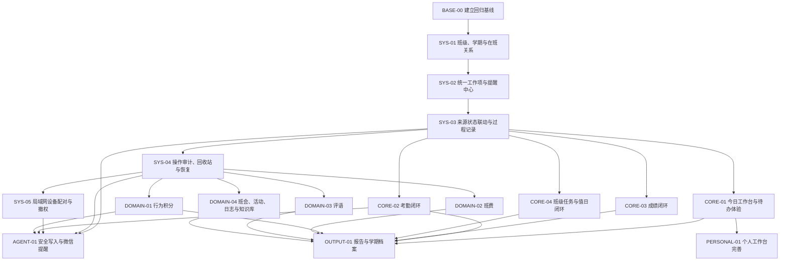

# 美美大王工作台系统功能后续开发计划（审查后执行版）

> 建立日期：2026-08-07
> 计划版本：v2.1
> 适用范围：系统业务功能、系统与 Agent 的能力交界面
> 当前执行分支：`codex/system-features`

## 1. 文档职责

本文件是后续**系统功能开发顺序、依赖关系和完成标准的唯一执行计划**。

- [功能清单](../功能清单.md)只记录当前已经具备什么，不负责安排开发顺序。
- [Agent 代理清单](Agent代理清单.md)只记录 Agent 核心、会话、模型和渠道能力。
- [Agent 能力矩阵](Agent能力矩阵.md)登记系统能力是否已经开放给网页 Agent 或微信 Agent。
- 本计划中的状态只有在对应验收条件全部满足后才能更新为“已完成”。只有页面、接口或数据库表不算完成。

状态约定：

| 状态 | 含义 |
|---|---|
| ⬜ 待开始 | 依赖可能尚未完成，还未进入实现 |
| 🚧 进行中 | 已开始实现，但尚未通过全部验收 |
| ✅ 已完成 | 代码、迁移、测试、界面和文档均通过验收 |
| ⛔ 阻塞 | 存在不能由当前任务自行解决的明确阻塞 |

### 1.1 当前基线

本计划以本次全项目审查和当前分支代码为基线，不重新安排已经完成的底层能力。

| 能力层 | 当前状态 | 后续含义 |
|---|---|---|
| 数据安全底座 | 已完成班级/学期隔离、审计、回收站、局域网设备授权 | 后续业务模块必须复用这些能力，不再自建上下文、日志或删除机制 |
| 行动闭环底座 | 已完成统一工作项、来源联动、过程记录、今日工作台 | 所有异常、截止和复查统一进入工作项，不新增第二套待办 |
| 高频业务 | 考勤和成绩闭环已完成；班级任务与值日待完善 | 下一工作包是班级任务、材料收集和值日，不并行改动同一业务骨架 |
| 通用表格模块 | 积分、班费、评语、班会、活动和日志仍以轻量记录为主 | 按业务价值逐个结构化，保留旧数据兼容和迁移报告 |
| Agent | 网页和微信共用只读工具层，具备规划展示和失败处理 | 系统写入闭环未完成前继续只读；写工具最后接入业务服务 |
| 产品形态 | 本地桌面主程序 + 局域网移动浏览器 | 不扩展云端、多租户、独立移动 App 或公网访问 |

### 1.2 后续执行路线

| 执行批次 | 工作包 | 要解决的核心问题 | 阶段出口 |
|---|---|---|---|
| R1 高频教师工作 | `CORE-03`、`CORE-04` | 成绩闭环已完成；材料收集和值日仍不能完整进入跟进闭环 | 教师每天高频事项均可从发现、处理到复查完成 |
| R2 关键账目数据 | `DOMAIN-01`、`DOMAIN-02` | 积分和班费缺少可重算、可撤销的可信流水 | 任一汇总结果都能追溯到原始流水并通过审计恢复 |
| R3 教育过程沉淀 | `DOMAIN-03`、`DOMAIN-04` | 评语、班会、活动、日志和知识库相互割裂 | 记录可关联学生、生成行动并沉淀为可检索材料 |
| R4 汇总与自动化 | `OUTPUT-01`、`AGENT-01` | 报告依赖手工整理，Agent 尚不能安全执行操作 | 报告可追溯；低风险 Agent 写入具备确认、权限、幂等和恢复 |
| R5 个人工作台 | `PERSONAL-01`、`PERSONAL-02` | 个人模块闭环不足，考研入口价值未验证 | 健康模块可持续使用，并对考研模块作出明确产品决策 |

优先级原则：先处理“每天发生、出错成本高、必须跟进”的教师工作，再处理汇总输出和 Agent 自动化。每个批次通过发布门槛后才能进入下一批次。

### 1.3 审查结论与计划映射

本次审查不建议继续横向增加孤立页面。当前缺口不是“功能入口太少”，而是已有记录尚未全部形成可追踪、可复查、可汇总的完整流程。审查结论统一映射为以下五类工作：

| 审查结论 | 对应工作包 | 处理原则 |
|---|---|---|
| 成绩、材料收集和值日是当前最高频教师工作；成绩已完成，材料和值日仍待闭环 | `CORE-03`、`CORE-04` | 继续完成 R1，不与低频模块并行扩张 |
| 积分和班费的结果无法完全从可信流水重算 | `DOMAIN-01`、`DOMAIN-02` | 先结构化流水、撤销和审计，再做图表与高级统计 |
| 评语、班会、活动、日志和知识库之间缺少学生、行动与材料关联 | `DOMAIN-03`、`DOMAIN-04` | 以稳定关联和过程沉淀为主，不做新的通用 JSON 表 |
| 周报、月报和学期总结仍依赖人工拼接 | `OUTPUT-01` | 等上游业务结构化后统一生成，避免复制统计逻辑 |
| Agent 已具备查询能力，但写入缺少统一确认和恢复边界 | `AGENT-01` | 复用系统业务服务，最后开放低风险写入；网页与微信分别授权 |
| 个人健康和考研入口不影响班主任主流程 | `PERSONAL-01`、`PERSONAL-02` | 教师主闭环稳定后再投入，并先验证持续使用价值 |

因此，后续优先级只由三项因素决定：用户是否每天使用、错误是否会造成真实工作损失、该能力是否是后续模块的数据依赖。视觉优化和便利性增强不能越过业务闭环缺口提前进入主线。

## 2. 产品目标与闭环定义

当前阶段不再以“新增更多页面”为主要目标，而是把班主任高频工作串成以下闭环：

```text
班级/学期建档
  → 发现或记录问题
  → 规则识别与安排跟进
  → 到期提醒
  → 执行与过程记录
  → 结果复查并回写来源
  → 周/月/学期汇总和归档
```

一个业务功能只有同时满足以下条件，才算形成闭环：

1. 有明确入口，且空状态能引导用户完成第一次操作。
2. 数据使用稳定 ID 关联学生、班级、学期和来源记录。
3. 支持必要的创建、编辑、状态变化、完成或关闭操作。
4. 到期或异常能够进入统一工作项与提醒中心。
5. 完成时记录结果，并按规则回写来源对象；状态变化可追溯。
6. 支持查询、导出和学期归档；危险写操作可以审计和恢复。
7. 桌面与局域网移动端都能完成主要流程。
8. 有后端自动化测试；主要交互至少有一条浏览器流程验证。

## 3. 全程执行规则

1. **先业务服务，后入口。** 新能力先在 `backend/app/services/` 实现，再接 API 和系统页面；需要开放给 Agent 时，最后封装 Agent 工具。路由、Vue 页面和 Agent 工具不得各自复制业务规则。
2. **不为核心业务新增通用 JSON 表。** 学生、任务、考勤、成绩、积分、班费、评语、班会和活动等核心对象使用结构化表和增量迁移。
3. **迁移必须保留现有数据。** 每次数据库结构变化都要增加迁移版本、升级前备份、旧数据回填和隔离数据库测试；不得直接修改真实 `data/workbench.db`。
4. **不建立第二套待办。** 优先扩展现有待办结构为统一工作项；事件、沟通、关注、考勤规则和班级任务通过来源字段接入，不能各自维护无法同步的提醒状态。
5. **归档不等于删除。** 已归档学期默认只读；业务记录使用软删除和回收站，数据库备份只作为最后恢复手段。
6. **Agent 写入晚于系统写入。** 对应系统服务、权限、确认、幂等、审计和恢复能力未完成前，不开放 Agent 写工具。
7. **本地产品边界不变。** 当前仍是本地桌面主程序加局域网浏览器访问，不引入云端、多租户或独立移动 App。
8. **每次只推进一个工作包。** 先完成其依赖和验收，再修改本计划状态并进入下一个工作包。

## 4. 依赖顺序



`CORE-*` 和 `DOMAIN-*` 可以在依赖满足后并行开发，但同一数据表和同一业务服务不得并行修改。

## 5. 阶段零：建立可重复验证的基线

### ✅ BASE-00 当前行为与测试基线

**目标**：在修改数据骨架前，确认现有能力可重复验证，并为迁移提供固定样本。

**范围**：

- 运行现有后端全量测试、前端生产构建和 UI 冒烟测试，记录当前结果。
- 在隔离数据目录建立最小迁移样本，至少包含学生、事件、待办、关注、沟通、考勤、成绩、班级任务和一个通用工作表记录。
- 为“升级前记录数、升级后记录数、关键关联、重复运行迁移”建立自动检查。
- 不修改真实数据库，不在此工作包新增产品功能。

**完成标准**：现有验证全部通过；迁移样本可由测试自动创建和销毁；同一迁移重复启动不会重复写入或丢失数据。

**完成记录（2026-08-07）**：增加固定 v4 业务迁移样本及升级/重复启动测试；47 项后端测试、前端生产构建和 UI 冒烟测试通过。

## 6. 阶段一：补齐系统骨架

### ✅ SYS-01 班级、学期与学生在班关系

**依赖**：`BASE-00`

**目标**：让所有教师业务拥有明确的班级和学期上下文，并支持结转与只读归档。

**范围**：

- 增加班级、学期、学生在班关系及其状态；学生基础档案与“在哪个班、哪个学期就读”分离。
- 为事件、待办、关注、沟通、考勤、成绩、班级任务、值日等结构化记录补充 `class_id`、`term_id`。
- API 使用明确的班级和学期参数或请求上下文；不得用一个可被不同设备相互覆盖的服务端全局“当前班级”。
- 迁移时自动创建默认班级和默认学期，将所有旧记录无损回填；默认名称允许用户之后修改。
- 提供当前班级/学期切换、学期结转、学生转入/转出/毕业和归档查看。
- 已归档学期默认只读；跨学期复制只复制配置和模板，不复制历史业务结果。

**明确不做**：多账号、云端组织、复杂教务排课和校级权限体系。

**完成标准**：旧数据库可自动升级且记录总量与关键关联不变；切换班级/学期后列表、统计、导入和导出严格隔离；归档学期不能被普通编辑；后端迁移与隔离测试、前端构建和班级切换浏览器流程全部通过。

**完成记录（2026-08-07）**：数据库升级至 v5，增加班级、学期和学生在班关系，并为教师业务记录回填班级/学期；网页端增加上下文切换、班级与学期管理、学期结转、转班和归档只读。旧 v4 样本无损升级及重复启动、跨班级/学期隔离、个人工作表不分班、归档写保护和转班均有自动测试。53 项后端测试、前端生产构建、桌面/窄屏浏览器流程和 UI 冒烟测试通过。

### ✅ SYS-02 统一工作项、提醒中心与日历

**依赖**：`SYS-01`

**目标**：把分散在不同模块中的“下一步行动”汇总为唯一工作入口。

**范围**：

- 评估并扩展现有待办为统一工作项，至少包含来源类型、来源 ID、班级、学期、负责人、优先级、计划时间、截止时间、状态和完成结果。
- 聚合手工待办、事件跟进、家校回访、关注复查、考勤规则命中、班级任务截止和值日安排。
- 提供逾期、今天、未来七天、已完成和已取消筛选；现有待办页的静态筛选标签改为真实筛选。
- 提供列表和日历入口，支持编辑、延期、取消、完成说明和回到来源记录。
- 先实现应用内提醒，不在本工作包接入系统推送或微信主动通知。

**完成标准**：所有指定来源都能生成或关联一个可追踪工作项；同一来源重复触发不会创建重复提醒；筛选数量与列表一致；完成、延期和取消均有测试；桌面与移动端可以完成主要流程。

**完成记录（2026-08-07）**：数据库升级至 v6，在既有 `student_tasks` 上增加稳定来源键、来源类型/ID、负责人、计划时间、完成结果和取消时间；事件、家校沟通、关注复查、考勤规则、班级任务和值日统一通过 `work_items` 服务幂等生成工作项。提醒中心提供逾期、今天、未来七天、完成、取消和全部真实筛选，支持搜索、列表/日历、编辑、延期、完成说明、取消原因、重新打开和返回来源记录。迁移 v4/v5 数据回填、来源幂等、时间筛选、状态操作和并发创建均有自动测试；59 项后端测试、前端生产构建、桌面/390px 浏览器流程和来源跳转通过。

### ✅ SYS-03 来源状态联动、过程记录与复查

**依赖**：`SYS-02`

**目标**：让事件、沟通、关注和待办从“分别记录”变成一致的跟进闭环。

**范围**：

- 事件支持编辑、过程记录、处理结果、下一次复查和正式关闭。
- 家校沟通支持补充反馈、约定结果、回访完成和下一次联系。
- 关注事项支持多次进展记录、复查结论、继续关注或关闭，不再使用前端硬编码结论。
- 工作项完成时按来源类型回写来源状态；来源关闭时明确处理尚未完成的关联工作项，不静默删除。
- 记录关键状态变化历史，并统一进入学生成长时间线。

**完成标准**：事件、沟通、关注三条流程都具备“创建 → 安排 → 到期 → 处理 → 复查/关闭”的自动化测试；重复提交保持幂等；学生时间线可以解释每次状态变化；页面不再出现来源和工作项状态相互矛盾。

**完成记录（2026-08-07）**：数据库升级至 v7，增加统一 `workflow_updates` 过程/状态历史及事件、沟通关闭结论。事件、家校沟通和关注事项共用 `workflow` 服务与“处理与复查”弹窗，可编辑处理信息、记录多次进展、安排下次复查并查看历史；关闭来源时必须明确完成或取消关联工作项。工作项和来源状态、日期双向联动，完成与重新打开均同步回写，重复 `request_id` 不会重复处理，过程记录进入学生时间线。63 项后端测试、前端生产构建和真实浏览器过程记录流程通过。

### ✅ SYS-04 系统操作审计、软删除与记录级恢复

**依赖**：`SYS-03`

**目标**：让系统业务写操作可追溯、误删可恢复，并为未来 Agent 写入提供安全底座。

**范围**：

- 增加系统业务操作审计，记录操作者/渠道、对象、动作、时间、结果和脱敏参数摘要。
- 核心业务删除改为软删除，增加按模块筛选的回收站、恢复和永久删除确认。
- 编辑、状态变化、恢复和归档进入审计；API Key、手机号、地址等敏感内容不得写入完整日志。
- 所有核心写操作通过业务服务；现有数据库备份与恢复保留为整库保障。

**完成标准**：学生和阶段一涉及的核心记录可以删除、在回收站恢复且关联不丢失；审计能定位到原记录和操作渠道；敏感字段脱敏测试通过；永久删除有二次确认和权限边界。

**完成记录（2026-08-07）**：数据库升级至 v8，为学生、事件、工作项、关注、家校沟通、成绩、考勤规则、班级任务、值日和通用工作表记录增加软删除标记，并新增系统业务审计与回收站。网页端提供按模块筛选、原位恢复、受控永久删除和操作审计入口；来源记录删除/恢复时关联工作项同步隐藏/恢复。永久删除仅允许本机请求且必须输入固定确认文字，已归档学期保持只读；审计记录渠道、操作者、对象、动作和结果，对 API Key、令牌、电话与地址等字段统一脱敏。69 项隔离后端测试、前端生产构建、桌面及 390px 浏览器删除—恢复流程和控制台检查通过。

### ✅ SYS-05 局域网设备配对与访问撤权

**依赖**：`SYS-04`

**目标**：避免二维码或访问链接长期流转后仍可访问学生数据。

**范围**：

- 用短时配对码或本地 PIN 完成新设备授权，当前启动令牌不再作为长期设备凭证。
- 展示已授权设备、最近访问时间和状态，支持单设备退出与全部撤权。
- 令牌过期、主动撤权和服务重启后的行为明确；未授权请求返回可恢复的提示。
- 保持“可信局域网使用、不得映射公网”的产品边界。

**完成标准**：未配对设备无法读取 API；已配对设备在有效期内可正常使用；撤权立即生效；二维码过期和重新配对流程有后端测试与真实浏览器验证。

**完成记录（2026-08-07）**：数据库升级至 v9，新增短时配对会话和可撤权设备表；电脑端可生成 5 分钟有效、仅可使用一次的二维码，并查看设备状态、最近访问时间、单设备撤权和全部撤权。设备凭证默认有效 90 天，数据库只保存 SHA-256 哈希，服务重启后保持授权；局域网 API 对未配对、已过期和已撤权设备统一拒绝。移动端支持主动退出，授权失效或重复使用二维码时显示可恢复的重新配对提示。75 项隔离后端测试、前端生产构建以及桌面端和 390px 局域网真实浏览器配对—退出—失效流程验证通过；有效流程无控制台错误。

## 7. 阶段二：完成教师高频业务闭环

### ✅ CORE-01 今日工作台与待办体验

**依赖**：`SYS-03`

**目标**：把首页从统计看板升级为每天可直接处理工作的行动中心。

**范围**：

- 首页突出逾期、今天、即将到期、规则命中、材料收集进度和需要复查的学生。
- 所有卡片可进入带筛选条件的目标页面，支持完成、延期和继续处理。
- 学生详情增加当前风险、最近变化、未完成行动和阶段结论。
- 为图表补充文字摘要；修复小字号、低对比度和不可键盘操作的主要入口。

**完成标准**：首页数字与统一工作项查询一致；用户从首页两步内可以完成或进入任一待处理项；待办筛选、空状态、键盘操作和移动布局通过浏览器验证。

**完成记录（2026-08-07）**：首页升级为行动中心，直接展示逾期、今天、未来七天、考勤规则命中、材料收集进度和到期复查学生，并复用统一工作项服务保证数字与列表口径一致。首页可直接进入完成、延期、处理、关注复查和指定班级任务；提醒中心支持根据 URL 自动打开对应动作并预填延期日期。学生详情增加当前风险及原因、未完成行动、最近变化、阶段结论和成绩/积分文字摘要；成绩、积分和健康图表补充可读文字摘要及图表语义标签。动态 GET 请求禁用浏览器缓存，避免处理事项后仍显示旧数字。77 项隔离后端测试、前端生产构建、桌面及 390px 浏览器流程、Escape 关闭与焦点返回、筛选跳转和有效流程零控制台错误均通过；本工作包没有新增数据库迁移，当前仍为 v9。

### ✅ CORE-02 考勤规则自动执行与异常跟进

**依赖**：`SYS-03`

**目标**：让考勤异常自动进入处理流程，而不是依赖用户手工点击规则评估。

**范围**：

- 支持早晚自习等考勤场景、批量备注、按学生/月/周次统计和异常名单。
- 保存考勤或启动应用时按明确策略评估规则，并保留每次评估历史。
- 规则命中生成幂等工作项；规则解除、任务完成和再次命中的行为明确。
- 增加规则启停、最近执行时间、命中学生和处理状态。

**完成标准**：固定测试数据能稳定命中迟到、缺勤和连续缺勤规则；重复评估不重复创建工作项；异常处理结果可回到学生时间线；统计口径有自动化测试。

**完成记录（2026-08-07）**：数据库升级至 v10，将旧版考勤数据无损迁入结构化 `attendance_records`，并新增规则执行历史和命中状态。考勤支持常规到校、早自习、上午、下午、晚自习五类场景，异常原因、到离校时间、单人及批量备注，以及按学生、月份、ISO 周次和场景统计。保存考勤、启动应用、规则变更和手工检查共用同一评估服务；首次命中幂等生成工作项，完成任务后标记已处理，条件解除后自动解除，之后再次命中复用并重开原工作项。规则页面展示启停状态、最近执行、命中学生、处理状态和执行历史；结果进入学生时间线。83 项隔离后端测试、前端生产构建、UI 冒烟测试及桌面/390px 真实浏览器闭环通过，控制台 0 错误、0 警告。

### ✅ CORE-03 成绩导入、分析与异常跟进

**依赖**：`SYS-03`

**目标**：把成绩模块从“导入和看趋势”提升为可核验、可发现问题、可安排跟进。

**范围**：

- 增加考试和科目配置、成绩导入预览、错误行提示、重复记录策略与确认提交。
- 增加班级均值、排名、分层和个人变化；所有统计明确缺考和缺失值口径。
- 用户确认异常规则后，识别明显退步并生成学生跟进工作项。
- 支持从异常学生回到成绩详情和学生时间线。

**完成标准**：长表与宽表导入均先预览后确认；错误数据不会部分写入；统计结果有固定样本断言；异常工作项不重复并能追溯到具体考试记录。

**完成记录（2026-08-07）**：数据库升级至 v11，增加考试、科目、考试科目、导入批次、异常规则、规则执行和命中状态等结构化数据；旧成绩可无损回填，重复启动不重复迁移，学期结转只复制科目与规则配置，不复制考试和历史成绩。页面支持科目满分与考试配置、长表/宽表导入预览、错误单元格提示、重复记录更新/跳过策略和有效行确认提交；提交前再次校验，任一提交行失败时整批回滚。统计统一处理缺考、免考和未录入，不按 0 分计入均值；完整成绩生成班级均值、排名、A/B/C 分层、总分与排名变化。成绩下降规则幂等生成统一工作项，处理结果、解除和再次命中重开均进入学生时间线。并发连接改为每个工作线程独立 SQLite 连接，300 次并发成绩读取无失败；89 项隔离后端测试、前端生产构建、UI 冒烟、桌面及 390px 真实长宽表导入和异常跟进流程通过，浏览器控制台 0 错误、0 警告。

### ✅ CORE-04 班级任务、材料收集与值日闭环

**依赖**：`SYS-03`

**目标**：让集体事务具备模板、逾期、催办、凭证和完成约束。

**范围**：

- 班级任务增加模板、截止状态、未完成名单、批量催办、提交时间、附件或凭证。
- 未收齐时关闭任务必须显示差异并要求明确确认，不能无提示完成。
- 值日增加轮换规则、重复冲突检查、周视图和完成记录。
- 班级任务和到期值日接入统一工作项；催办先保留为应用内动作。

**完成标准**：任务进度、逾期名单和学生提交状态一致；附件失败不产生伪成功记录；值日排班能发现同一时段冲突；主要流程有后端测试和移动端浏览器验证。

**完成记录（2026-08-07）**：数据库升级至 v12，增加班级任务模板、完成结果、例外关闭人数、催办计数、附件元数据和值日轮换规则/成员/完成记录；迁移保留已有任务和值日数据，并在学期结转时复制任务模板和轮换规则。班级任务页面支持套用模板、按学生追踪提交、提交时间、备注、附件上传、失败回滚、批量催办、逾期状态和带缺交名单的确认关闭；值日页面支持单日/周视图、重复冲突检查、轮换预览与确认生成、统一工作项联动和完成记录。工作台直接关闭来源时同样经过缺交约束，避免任务状态漂移。93 项隔离后端测试、前端生产构建和 UI 冒烟通过；新增 CORE-04 后端流程测试覆盖例外关闭、附件原子性、催办、值日冲突、轮换和工作项回写。

## 8. 阶段三：把通用表格升级为业务模块

### ⬜ DOMAIN-01 行为积分流水

**依赖**：`SYS-04`

**目标**：用可追溯流水替代每周积分快照。

**范围**：积分规则、学生稳定 ID、加扣分流水、撤销、周期汇总、排名历史和异常阈值；旧通用表数据迁入历史流水或只读归档。

**完成标准**：任一总分都可由有效流水重算；撤销不删除原记录且进入审计；旧数据迁移有报告；排行、学生详情和导出结果一致。

### ⬜ DOMAIN-02 班费分类账与结算

**依赖**：`SYS-04`

**目标**：形成可核对、可结算、凭证完整的班费账本。

**范围**：收入/支出分类、经办人、票据附件、余额核对、月度结算和异常预警；已结算记录只能通过冲正或撤销处理。

**完成标准**：余额可由流水重算；结算前后修改规则明确；票据与记录关联可恢复；月度汇总和导出与流水一致。

### ⬜ DOMAIN-03 评语生成与审核工作流

**依赖**：`SYS-04`

**目标**：支持按学生批量生成、人工修改、审核和交付评语。

**范围**：评语模板和变量、批量生成、草稿/待审核/完成/已发送状态、按学生回溯和打印导出；Agent 只可在后续阶段生成草稿，不可越过审核状态。

**完成标准**：模板变量有缺失值提示；批量生成不会覆盖已人工编辑内容；状态流转和导出有测试；每条评语稳定关联学生、班级和学期。

### ⬜ DOMAIN-04 班会、活动、日志与知识库关联

**依赖**：`SYS-04`

**目标**：把零散记录变成可以产生行动、沉淀材料和复盘的工作流。

**范围**：

- 班会：模板、参与情况、会议结论和行动项。
- 活动：参与学生、预算、材料附件、执行结果和活动复盘。
- 日志：日历视图，关联学生、事件、待办、班会或活动。
- 知识库：站内 Markdown 阅读/编辑、全文搜索、标签及与班会、活动的稳定关联。

**完成标准**：班会和活动可生成统一工作项；日志能回到来源；知识库可在站内完成创建、搜索、阅读和编辑；文件与 SQLite 元数据不同步时有可恢复提示；旧通用表数据可访问且不丢失。

## 9. 阶段四：输出、Agent 与渠道增强

### ⬜ OUTPUT-01 周报、月报与学期档案

**依赖**：阶段二和阶段三全部完成

**目标**：复用已结构化的数据生成可信报告，而不是建立另一套手工统计。

**范围**：班级周报/月报、学生成长报告、学期汇总、归档导出；每个统计项可以追溯到来源记录。

**完成标准**：报告数据与业务列表一致；缺失数据和统计口径有说明；归档后可只读查看和导出；固定样本报告有自动断言和打印版浏览器验证。

### ⬜ AGENT-01 安全写入与微信提醒

**依赖**：`SYS-03`、`SYS-04`、`SYS-05`；保存考勤和记录行为积分还分别依赖 `CORE-02`、`DOMAIN-01`

**目标**：在不复制业务逻辑的前提下，让凯凯小兵执行低风险写入和必要提醒。

**范围**：

- 按 [Agent 代理清单](Agent代理清单.md)实现操作预览、用户确认、参数绑定、确认超时、幂等、权限、审计和恢复。
- 第一批只开放创建待办、记录沟通、保存考勤和记录行为积分；工具调用对应业务服务。
- 网页和微信分别配置权限；微信默认不展示敏感字段，不开放删除和批量高风险操作。
- 微信主动提醒只发送必要摘要，并提供回到网页处理详情的入口。

**完成标准**：未确认、确认过期、参数被替换、重复提交、越权和模型重试都不能产生意外写入；网页和微信渠道隔离测试通过；能力与权限同步登记到 [Agent 能力矩阵](Agent能力矩阵.md)。

## 10. 阶段五：个人工作台

### ⬜ PERSONAL-01 健康追踪完善

**依赖**：教师主闭环和统一提醒稳定

**目标**：补齐健康目标、提醒和周期复盘，同时保持个人数据与学生业务隔离。

**范围**：可编辑目标、饮食记录、周/月复盘、异常提示和可选提醒；目标不再使用前端固定值。

**完成标准**：目标和记录可编辑、可汇总、可导出；个人数据不会进入班级报告或微信学生查询；移动端主要流程通过验证。

### ⬜ PERSONAL-02 考研工作台决策

**依赖**：`PERSONAL-01`

**目标**：在教师主闭环稳定后重新确认是否开发考研模块，避免继续增加无关联页面。

**范围**：先形成独立需求说明和最小闭环；只有确认用户持续使用场景后，才进入学习计划、知识点、真题和进度统计开发。

**完成标准**：完成“开发、继续暂缓或移除入口”的明确产品决策；若开发，需另建独立执行计划，不在本工作包直接扩张功能。

## 11. 每个工作包的执行与交付方式

后续开发 Agent 接到系统功能任务时，按以下顺序执行：

1. 先读取 `AGENTS.md`、本计划和相关现状文档，选择依赖已满足的第一个待开始工作包。
2. 检查当前分支和未提交修改，列出本工作包的范围、明确不做内容和可验证成功标准。
3. 数据结构变化先写迁移与隔离测试；业务规则先写服务和测试；随后接 API、系统页面，最后评估 Agent 工具。
4. 使用隔离数据验证迁移和错误路径；禁止用真实数据库进行新增、删除、恢复或批量写入测试。
5. 根据改动运行后端全量测试、前端生产构建和必要的 UI 冒烟测试；涉及移动访问时增加窄屏验证。
6. 更新本计划状态、[功能清单](../功能清单.md)和受影响的用户文档；涉及 Agent 时同步更新能力矩阵与代理清单。
7. 一个工作包验收未完成时，不将其标记为完成，也不提前实施依赖它的后续工作包。

每次交付至少报告：修改文件、数据库迁移版本、已有数据兼容结果、测试命令与结果、未完成项和下一可执行工作包。

### 11.1 分支与提交约定

- 当前 `codex/core-04-class-ops` 完成并验收 `CORE-04`；后续工作包必须新建独立分支，不在本分支继续混入其他业务模块。
- 当前批次合并后，原则上一个工作包使用一个 `codex/<work-package>` 分支，例如 `codex/core-04-class-tasks`。
- 数据迁移与服务、API 与页面、测试与文档可以分成可验证提交；任一提交都不得包含密钥、真实学生数据、临时数据库和测试附件。
- 工作包尚未通过完成标准时只允许标记为“进行中”，不得为了合并而降低验收条件。

### 11.2 单个工作包启动卡

每次开始新工作包，先在任务说明中固定以下内容，避免实施过程中扩大范围：

| 项目 | 必填内容 |
|---|---|
| 用户结果 | 用户完成什么工作，问题如何真正结束 |
| 本次范围 | 数据、服务、API、页面、Agent 各自要改什么 |
| 明确不做 | 相邻但不属于本工作包的需求 |
| 数据兼容 | 迁移、旧数据回填、归档和恢复策略 |
| 风险场景 | 重复提交、并发、部分失败、缺失值、归档只读和越权 |
| 验收证据 | 自动测试、构建、浏览器流程、移动端和文档更新 |

## 12. 统一发布门槛

每个阶段进入 `main` 前必须同时满足：

- 增量迁移可在旧数据库上自动执行，升级前备份和重复执行安全。
- 后端全量测试通过，前端生产构建通过；关键用户流程通过浏览器冒烟测试。
- 没有把 API Key、访问令牌、真实学生隐私、临时数据库或测试附件提交到 Git。
- 空状态、加载、失败、重试、确认和移动端布局有明确表现。
- 核心交互支持键盘焦点、Escape 关闭和可读标签；图表提供文字摘要。
- 功能清单、用户手册、发布检查清单以及受影响的 Agent 文档保持一致。

## 13. 当前明确不进入开发范围

- 云端服务器、多租户 SaaS、校级组织架构和复杂角色权限。
- 独立 iOS/Android App、离线移动数据库和跨设备数据同步。
- 将局域网端口暴露到公网。
- 未经确认的 Agent 写入、Agent 删除、批量高风险写入和模型自主长期运行。
- 在教师主闭环稳定前扩展多微信账号、群聊、多模态、本地 MCP 或大型考研模块。

## 14. 下一步

### 14.1 后续执行队列

| 顺序 | 工作包 | 建议分支 | 开始条件 | 完成后产生的用户结果 |
|---:|---|---|---|---|
| 1 | ✅ `CORE-03` 成绩闭环 | 当前 `codex/system-features` | 已完成验收 | 成绩从导入、核验、统计、异常识别到跟进处理完整闭环 |
| 2 | ✅ `CORE-04` 班级任务、材料和值日 | `codex/core-04-class-ops` | `CORE-03` 合并且工作区干净 | 集体任务和每日值日可排期、催办、留痕并完成复查 |
| 3 | ⬜ `DOMAIN-01` 行为积分 | `codex/domain-01-points-ledger` | R1 发布门槛通过 | 任一学生积分和排名都可由有效流水重算并撤销 |
| 4 | ⬜ `DOMAIN-02` 班费 | `codex/domain-02-fund-ledger` | `DOMAIN-01` 的流水模式稳定 | 班费余额、凭证和结算均可核对、追溯和冲正 |
| 5 | ⬜ `DOMAIN-03` 评语 | `codex/domain-03-comments` | R2 发布门槛通过 | 评语可批量生成、人工修改、审核并按学生交付 |
| 6 | ⬜ `DOMAIN-04` 教育过程沉淀 | `codex/domain-04-education-records` | `DOMAIN-03` 的学生关联与状态模式稳定 | 班会、活动、日志、知识库和行动项相互关联 |
| 7 | ⬜ `OUTPUT-01` 报告与学期档案 | `codex/output-01-reports` | 阶段二、三全部完成 | 周报、月报、成长报告和学期档案可一键生成并追溯来源 |
| 8 | ⬜ `AGENT-01` 安全写入与微信提醒 | `codex/agent-01-safe-actions` | 对应系统写服务、审计和恢复均稳定 | 凯凯小兵可在确认后执行低风险操作，并通过网页/微信安全提醒 |
| 9 | ⬜ `PERSONAL-01` 健康追踪 | `codex/personal-01-health` | 教师主流程稳定 | 个人目标、记录、提醒和周期复盘形成独立闭环 |
| 10 | ⬜ `PERSONAL-02` 考研工作台决策 | 独立规划后确定 | 健康模块验收完成 | 明确开发、继续暂缓或移除入口，不默认扩建 |

此队列是后续执行的默认顺序。只有前一工作包被明确阻塞，且后续工作不修改相同数据表、服务和页面时，才允许临时跳转；跳转原因必须记录在本计划中。

### 14.2 当前启动点

`BASE-00`、全部 `SYS-*`、`CORE-01`、`CORE-02` 与 `CORE-03` 已完成。当前分支先保留本批次完整验收结果，不在尚未提交和合并的改动中混入下一业务包。

`CORE-04` 已完成并在本分支等待提交。下一工作包是 `DOMAIN-01 行为积分流水`；继续保持 Agent 只读与规划能力，不在本批次开放 Agent 写入。
